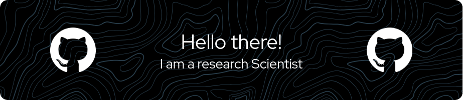

Freshly graduated PhD 📖 from Télécom Paris 🏫 and Institut Pasteur ⚕️ , where I focused on applying artificial intelligence \
to histology. During my thesis, I developed three different segmentation methods both interactive and non-interactive \
taking into account various levels of supervision to improve histological analysis.

In addition to my academic work, I enjoy playing badminton 🏸, tennis 🎾, and chess :chess_pawn: . \
You can reach me using my personal Email 

